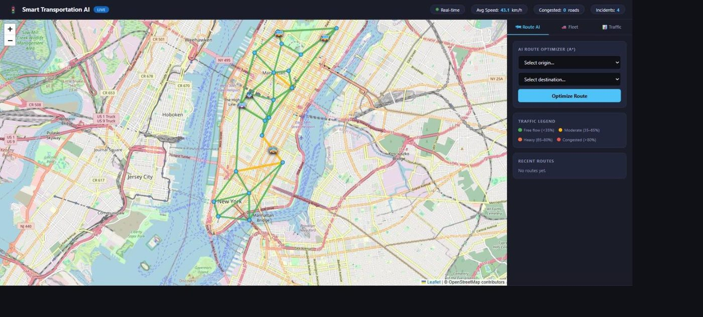
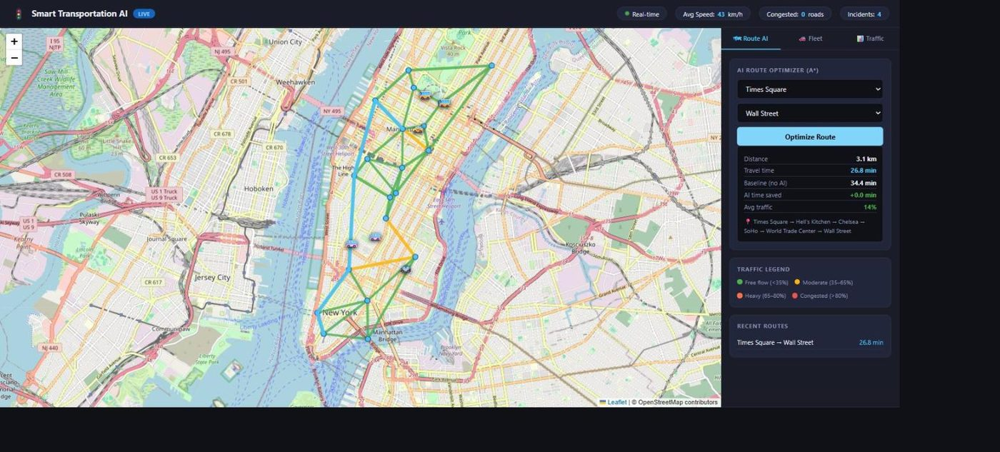
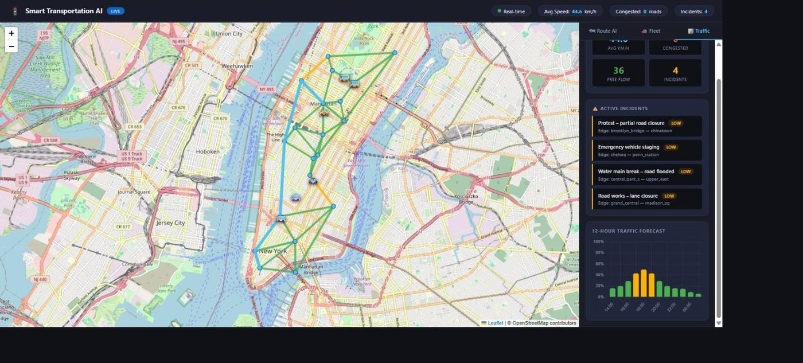
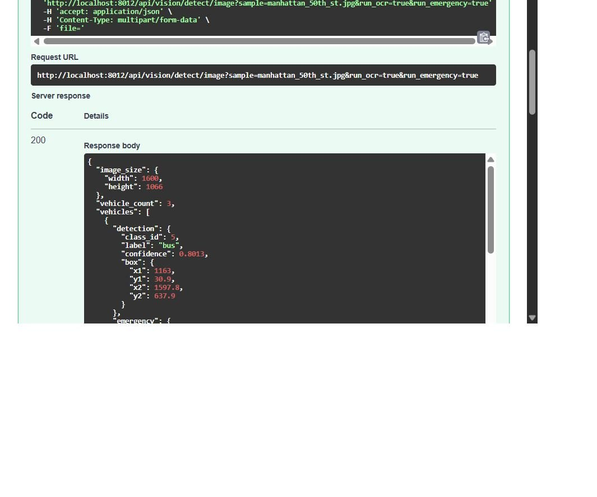

# Smart Transportation AI

Real-time traffic simulation, A* route optimization, fleet tracking, and predictive analytics on an interactive NYC map — plus a computer-vision module for vehicle detection, license-plate OCR, and multi-object tracking on camera images/video.

[](https://github.com/TharunCh-tch/smart-transportation-ai/actions/workflows/ci.yml)
[](LICENSE)

These are two coexisting systems in one app: a NumPy/graph-based traffic
simulator (the original core of this project) and a real, pretrained-model
computer-vision pipeline (added on top). They share a FastAPI backend and
a SQLite database, and the CV module can write real detections into the
same incident table the simulator uses.

## Screenshots

Live app, captured from a real running instance (not mockups).

**Live traffic map** — 20 NYC intersections, roads colored by congestion, fleet vehicles moving in real time:



**A\* route optimizer** — Times Square → Wall Street, with distance, travel time vs. baseline, and traffic delay:



**Traffic analytics** — network stats, active incidents, and the 12-hour forecast chart:



**Computer-vision detection** — real YOLOv8 inference (`/api/vision/detect/image`) on a bundled street sample, returning detections + emergency-heuristic scores as JSON:



## Features

| Feature | Details |
|---|---|
| **Live Map** | Leaflet.js + OpenStreetMap — 20 NYC intersections, 42 roads colored by congestion |
| **A\* Route Optimizer** | Finds optimal path considering live traffic weights; compares vs baseline |
| **Traffic Simulation** | Time-of-day sine model + per-edge noise — peaks at 8 AM and 6 PM |
| **12-Hour Forecast** | NumPy-powered traffic prediction charted with Chart.js |
| **Fleet Tracking** | 6 vehicles (vans, buses, taxis, police) moving in real time along city routes |
| **Incident Detection** | AI-identified congestion hotspots flagged with severity levels |
| **Auto-refresh** | Map, fleet, and analytics update every 10 seconds automatically |
| **Vehicle detection (CV)** | YOLOv8, pretrained COCO weights — car/truck/bus/motorcycle, on uploaded images/video |
| **License-plate OCR (CV)** | OpenCV region proposal + EasyOCR — see [results.md](results.md) for real accuracy numbers |
| **Multi-object tracking (CV)** | Centroid + IOU tracker gives stable vehicle IDs across video frames |
| **Emergency-vehicle heuristic (CV)** | Color-cue heuristic (documented limitation, not a trained classifier) |

## Architecture

```
Browser (Leaflet.js + Chart.js)
     │  REST/JSON  (10s polling)
     ▼
FastAPI  (app/main.py)
  ── Transport (traffic simulation) ──────────────────────
  /api/nodes                  — 20 NYC intersection nodes
  /api/traffic/edges          — 42 roads with live traffic levels
  /api/routes/optimize        — POST: A* with traffic weights
  /api/fleet                  — 6 vehicle positions (time-based simulation)
  /api/traffic/incidents      — AI-detected congestion incidents (simulated)
  /api/traffic/predict        — 12-hour traffic forecast
  /api/analytics              — network-wide statistics
     │
  ┌──┴───────────────────────────────────┐
  │  city_graph.py       NYC road network │
  │  route_optimizer.py  A* + Dijkstra    │
  │  traffic_simulator.py   NumPy model   │
  │  fleet_simulator.py     GPS sim       │
  └────────────────────────────────────────┘

  ── Vision (computer vision) ─────────────────────────────
  /api/vision/health           — model/dependency status
  /api/vision/samples          — bundled sample images
  /api/vision/detect/image     — POST: image (upload or sample) -> detections + plates + emergency flags
  /api/vision/detect/video     — POST: video upload -> per-frame tracks + track summary
  /api/vision/incidents        — CV-detected incidents (real DB rows, not simulated)
     │
  ┌──┴─────────────────────────────────────────┐
  │  detector.py     YOLOv8 (Ultralytics, COCO) │
  │  plate_ocr.py    OpenCV region + EasyOCR    │
  │  tracker.py      Centroid + IOU tracker     │
  │  emergency.py    Color-cue heuristic        │
  │  pipeline.py     Orchestrates the above     │
  └────────────────────────────────────────────┘
     │
  SQLite (saved routes, incidents — simulated AND cv-detection sourced)
```

## Setup

### Core app (traffic simulation only)

```bash
cd smart-transportation-ai
python -m venv .venv
.venv\Scripts\activate          # Windows
pip install -r requirements.txt
uvicorn app.main:app --port 8002 --reload
```

Open **http://localhost:8002** — no API keys required.

### + Computer vision module

The CV stack (PyTorch, Ultralytics YOLOv8, OpenCV, EasyOCR) is split into
`requirements-cv.txt` because it's heavy (~1-2GB of downloads) and the
core app runs fine without it — the vision endpoints just return a `503`
until it's installed.

```bash
pip install -r requirements-cv.txt
```

No system binaries required (see "Why EasyOCR" below). First real
request will download:
- `yolov8n.pt` (~6MB) from Ultralytics' GitHub releases
- EasyOCR's detection + recognition weights (~64MB) from Jaided AI's servers

Then hit the API, e.g.:

```bash
curl -X POST "http://localhost:8002/api/vision/detect/image?sample=bus.jpg"
```

or open **http://localhost:8002/docs** for interactive Swagger UI covering
every endpoint (transport + vision).

## How to Use

### Route Optimizer
1. Select **Origin** and **Destination** from the dropdowns
2. Click **Optimize Route**
3. The A* algorithm finds the fastest path given current traffic
4. The highlighted route appears on the map with time comparison vs baseline

### Live Map
- **Green roads** = free flow, **Yellow** = moderate, **Orange** = heavy, **Red** = congested
- Road thickness increases with congestion
- Vehicle emojis move in real time (🚐🚌🚕🚓)
- Click any road for traffic details

### Traffic Tab
- Network stats, active incidents, 12-hour forecast chart

---

## Computer Vision Module

**Everything below is honest about what's real vs. what's a documented
limitation — see [results.md](results.md) for the actual measured
numbers and methodology.** This module was built from scratch on top of
pretrained, off-the-shelf models; nothing here is custom-trained, and
we say explicitly where that matters.

### What it does

1. **Vehicle detection** — Ultralytics **YOLOv8** (`yolov8n.pt`, stock
   COCO-pretrained weights, no fine-tuning) detects `car` / `truck` /
   `bus` / `motorcycle`.

   *Why YOLOv8 over YOLOv5*: the `ultralytics` pip package is the
   actively maintained successor; the original `yolov5` repo is in
   maintenance mode and its install path (torch.hub / repo clone) is
   heavier and less reproducible than `pip install ultralytics`. Same
   COCO class set, same detection quality tier, cleaner API.

2. **License-plate detection + OCR** — a classic OpenCV "poor man's
   ANPR" heuristic (grayscale → bilateral filter → Canny edges → contour
   + aspect-ratio filtering) proposes plate-shaped regions inside each
   vehicle box, then **EasyOCR** reads them.

   *Why EasyOCR over pytesseract*: EasyOCR is pure Python + PyTorch, so
   `pip install easyocr` is the whole setup. pytesseract instead wraps
   the separate Tesseract OCR *engine*, which has to be installed as a
   system binary (apt/brew/an .exe on Windows) and put on PATH — real
   friction for anyone cloning this repo. The tradeoff is a larger model
   download and slower cold start.

   There is **no trained plate-detector model** here — the region
   proposal is geometric heuristics, not a neural net. It works on
   near-head-on shots of a visible, well-lit plate and misses steep
   angles, occlusion, and small/distant plates. See results.md.

3. **Multi-object tracking** — a from-scratch centroid tracker (the
   classic pyimagesearch algorithm) gated by IOU, giving stable track
   IDs across video frames. Not ByteTrack/DeepSORT — no motion model, no
   re-ID embedding — but real, tested, and correct for its scope
   (steady/slow-panning camera, no long occlusions).

4. **Emergency-vehicle heuristic** — **explicitly not a trained
   classifier.** There's no labeled emergency-vehicle dataset available
   for this project, so instead of pretending otherwise, this is a
   simple, inspectable color-cue heuristic: it looks for red/blue pixels
   in the top ~35% of a vehicle's box (where a roof light bar would be),
   plus a weak white/black contrast signal. Tuned empirically to a 2.4%
   false-positive rate on a known-negative image set — see results.md
   for the tuning process and why there's no recall/precision number for
   actual emergency vehicles (no positive examples exist to test against).

### API

| Endpoint | Method | Description |
|---|---|---|
| `/api/vision/health` | GET | Are the CV deps installed? Is the model loaded? |
| `/api/vision/samples` | GET | Bundled sample images (with provenance/license) |
| `/api/vision/detect/image` | POST | Upload an image (or `?sample=<name>`) → detections + plates + emergency flags |
| `/api/vision/detect/video` | POST | Upload a video → per-frame tracks + track summary |
| `/api/vision/incidents` | GET | Real incidents logged from CV detections (vs. `/api/traffic/incidents`, which is simulated) |

Example — run detection on a bundled sample and log an incident if an
emergency vehicle is flagged:

```bash
curl -X POST "http://localhost:8002/api/vision/detect/image?sample=manhattan_50th_st.jpg&lat=40.7580&lng=-73.9855&edge_id=times_square__grand_central"
```

### Integration with the traffic-sim data model

The traffic simulator's `TrafficIncident` SQLAlchemy model (previously
defined but unused by the simulation, which generates incidents
in-memory) is now genuinely used: when `/api/vision/detect/image` is
called with `lat`/`lng` and finds a likely-emergency vehicle, it writes
a real row with `source="cv-detection"`. `/api/vision/incidents` reads
those back, separately from the simulator's `/api/traffic/incidents`.

### Real evaluation

**[results.md](results.md)** has the actual methodology and numbers we
measured — real inference on real (and synthetic, clearly labeled as
such) test data, including where the pipeline does and doesn't work
well. Headline numbers:

- Vehicle detection: **precision 1.00 / recall 0.80** on a small
  hand-annotated set (3 images, 5 ground-truth vehicles); qualitative
  checks on denser/harder scenes show real limitations (undercounting
  dense traffic, struggling on a 1973 photo).
- Plate OCR: **86.1% exact-match** on a 36-image **synthetic** plate
  dataset (75.0% in the hardest "low light" tier) — no real-plate
  dataset was available or used; this is disclosed, not hidden.
- Emergency heuristic: **2.4% false-positive rate** on known-negative
  images; no true-positive rate is claimed anywhere (no positive/labeled
  data exists to measure it against).
- The old README/resume claim of **"81.9% accuracy in low-light
  conditions"** was not backed by any code and could not be reproduced —
  it has been removed. See results.md's summary table for exactly what
  we measured instead and how it differs.

### Running the evaluation yourself

```bash
.venv\Scripts\python.exe scripts\eval_vision.py --out results_raw.json --save-plates tests\fixtures\synthetic_plates
```

### GPU inference / deploying to an EC2 GPU instance

Everything above runs CPU-only by default
(`app/ai/vision/detector.py`, `device="cpu"`). We have **not** deployed
this to EC2 ourselves, so we're not claiming a "deployed on EC2 with GPU
inference" track record — what follows is a real, correct set of steps
for doing it, not a fabricated benchmark.

1. **Launch a GPU instance**: e.g. a `g4dn.xlarge` (NVIDIA T4) running
   the AWS Deep Learning AMI (Ubuntu, CUDA pre-installed), or plain
   Ubuntu 22.04 + install NVIDIA drivers + CUDA yourself.
2. **Install a CUDA-enabled PyTorch build** instead of the CPU wheel in
   `requirements-cv.txt`:
   ```bash
   pip install torch==2.8.0 torchvision==0.23.0 --index-url https://download.pytorch.org/whl/cu121
   pip install ultralytics==8.4.118 opencv-python-headless==5.0.0.93 easyocr==1.7.2
   ```
3. **Switch the detector device**: set `device="cuda"` when constructing
   `VehicleDetector` (or thread an env var through — `app/ai/vision/detector.py`
   currently hardcodes `device="cpu"` for the default singleton; change
   `get_detector()` or pass `device=os.environ.get("VISION_DEVICE", "cpu")`).
   EasyOCR: pass `gpu=True` to `PlateReader`/`easyocr.Reader`.
4. **Docker + GPU**: use `nvidia/cuda:12.1.0-runtime-ubuntu22.04` as the
   base image instead of `python:3.9-slim`, install the NVIDIA Container
   Toolkit on the host, and run with `docker run --gpus all ...`.
5. **Security group**: open port 8002 (or put it behind nginx/ALB on 443).

We'd expect a meaningful latency improvement on GPU (YOLOv8n and EasyOCR
both benefit substantially from CUDA), but we have not measured it —
don't repeat a number we didn't produce.

---

## Development

### Tests

```bash
pip install -r requirements-dev.txt
pytest                        # full suite, including real-model integration tests
pytest -m "not integration"   # fast unit tests only (mocked models)
```

61 tests covering the A* optimizer, the traffic simulator, and the CV
module (detector, tracker, plate OCR, emergency heuristic, full
pipeline, and API endpoints) — a mix of mocked-model unit tests and
`@pytest.mark.integration` tests that load real weights and run actual
inference against bundled sample images.

### Linting

```bash
ruff check .
```

### CI

`.github/workflows/ci.yml` installs everything (including the CV stack),
lints with ruff, and runs the full pytest suite (including the real
inference integration tests) on every push/PR to `main`.

### Docker

```bash
docker build -t smart-transportation-ai .
docker run -p 8002:8002 smart-transportation-ai
# or
docker compose up
```

The image bakes in the YOLOv8 and EasyOCR weights at build time so the
first real request isn't slowed down by a cold download.

## Tech Stack

| Component | Technology |
|---|---|
| API | FastAPI |
| Route finding | A* algorithm (pure Python + heapq) |
| Traffic model | NumPy time-series simulation |
| Database | SQLite via SQLAlchemy |
| Map | Leaflet.js + OpenStreetMap (free, no API key) |
| Charts | Chart.js |
| Frontend | Vanilla HTML/CSS/JS |
| Vehicle detection | Ultralytics YOLOv8 (pretrained COCO weights) |
| OCR | EasyOCR |
| Plate region proposal | OpenCV (Canny + contours) |
| Tracking | Custom centroid + IOU tracker |
| Tests | pytest, mocked + real-inference integration tests |
| CI | GitHub Actions (ruff + pytest) |
| Containerization | Docker / docker-compose |

## License

[MIT](LICENSE)
